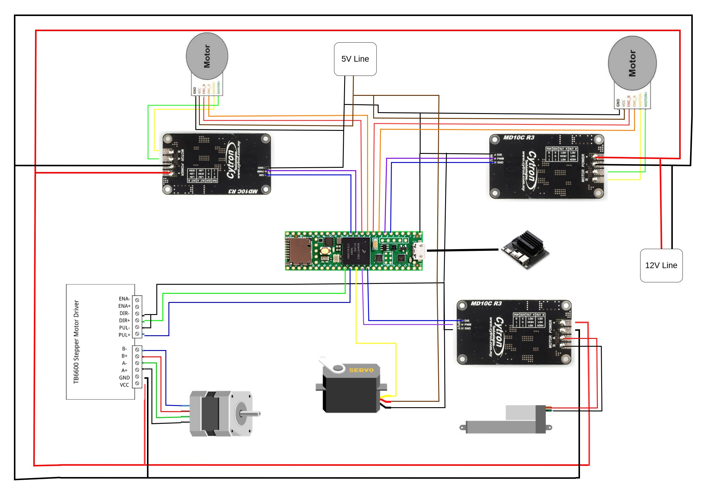

# **Pick-Place-Robotic-Arm**
## **Introduction:**

The tutorial explains about the control system of a 4 DoF Robotic Arm 

&nbsp;
## **Components Used**:
- Teensy 4.1
- Rhino 60rpm 40kgcm 12v Dc Planetary Geared Quad Encoder Servo Motor - 1
- Rhino 30rpm 70kgcm 12v Dc Planetary Geared Quad Encoder Servo Motor - 1
- MG995 Metal Gear Servo Motor - 1
- 12V 100MM Stroke Length Linear Actuator 7mm/S 1500N
- 57HS76-2804 NEMA23 18.9 kg-cm Stepper Motor – Round Type Shaft
- TB6600 Stepper Motor Driver -1
- Cytron DC Motor Driver MD10C -3
- 12 V DC Power supply
- BreadBoard
- Jumper Wires


&nbsp;

## **Pre-Requisite:**
- Ubuntu 20.04 with ROS Noetic
- VS Code with PlatformIO 

&nbsp;
&nbsp;

## **Circuit Diagram & Connections**

- 

&nbsp;
## **Procedure**:

1. Create New Project 
&nbsp;
2. Name the project, Select Board teensey 4.1


3. Create src/main.cpp, paste the code present in src folder. Change the CPR Value for adjusting the angle of rotation of motor.
&nbsp;
&nbsp;

4. Go to Include folder and make a file named PositionControl.h and paste the given code.
&nbsp;

5. Go to libraries section and search for ros. Download the Rosserial Arduino Library by Michael Ferguson. Select the project name and add project dependency.  

6. Add one more library named 'AutoPID' using same method.
&nbsp;
7. Compile the Code and upload to teensey.
8. Run the below commands in separate terminals:-

9. Terminal 1: 
```
roscore
```

10. Terminal 2: 

```
rosrun rosserial_arduino serial_node.py /dev/ttyACM0 _baud:=115200
```
11. Terminal 3: 
```
rostopic pub /joint_states sensor_msgs/JointState "header:
  seq: 0
  stamp: {secs: 0, nsecs: 0}
  frame_id: ''
name: ['']
position: [10,10,5,5,5]
velocity: [0]
effort: [0]"-1
```

## **References:**
- [Position Control](https://github.com/mission-mangal/PositionControl)

